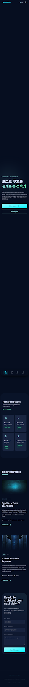

# Portfolio

> Full Stack Developer 이용민의 개인 포트폴리오 SPA


## 소개

Spring Boot 백엔드부터 React/Vue 프론트엔드까지 풀스택 개발 경험을 담은 개인 포트폴리오 사이트입니다.  
한국어/영어 전환, IntersectionObserver 기반 스크롤 애니메이션, 반응형 레이아웃을 순수 CSS와 커스텀 훅으로 구현했습니다.

## 주요 기능

- **한/영 i18n** — `LanguageContext` + `translations.ts`로 런타임 언어 전환
- **스크롤 애니메이션** — CSS 클래스 스왑 방식 (`fade-up`, `slide-left`, `slide-right`) + `useInView` 훅
- **스크롤 진행 표시** — 사이드 레일이 현재 섹션 위치를 실시간 반영
- **반응형 내비게이션** — 데스크톱 헤더 + 모바일 하단 네비게이션
- **연락처 폼** — 클라이언트 사이드 폼 처리

## 기술 스택

| 분류 | 기술 |
|------|------|
| UI | React 19, TypeScript 5.7 |
| 스타일 | Tailwind CSS 3, 커스텀 CSS 애니메이션 |
| 빌드 | Vite 6 |
| 배포 | GitHub Pages (`gh-pages`) |

## 시작하기

### 필수 요구사항

- Node.js 18+
- npm 9+

### 설치 및 실행

```bash
git clone https://github.com/M1NiDRAG0N/portfolio
cd portfolio
npm install
npm run dev        # http://localhost:5173/portfolio/
```

### 빌드 및 배포

```bash
npm run build      # TypeScript 체크 + 프로덕션 빌드 → dist/
npm run preview    # 프로덕션 빌드 로컬 미리보기
npm run deploy     # GitHub Pages 배포
```

## 프로젝트 구조

```
src/
├── components/       # 섹션별 컴포넌트 (Hero, About, TechStacks, SelectedWorks, Contact)
├── context/          # LanguageContext (ko | en)
├── hooks/            # useActiveSection, useScrollProgress, useInView
├── i18n/             # translations.ts — 모든 번역 문자열
└── App.tsx           # 섹션 순서 및 스크롤 레일 정의
public/
└── profile.jpg       # 프로필 사진 (직접 교체)
```

### 콘텐츠 수정 위치

| 콘텐츠 | 파일 |
|--------|------|
| 프로젝트 목록 | `src/components/SelectedWorks.tsx` — `projects` 배열 |
| 경력 타임라인 | `src/components/About.tsx` — `timeline` 배열 |
| 기술 스택 카드 | `src/components/TechStacks.tsx` — `stacks` 배열 |
| 번역 / 카피 | `src/i18n/translations.ts` |
| 프로필 사진 | `public/profile.jpg` |

## 스크린샷



## 라이선스

MIT
